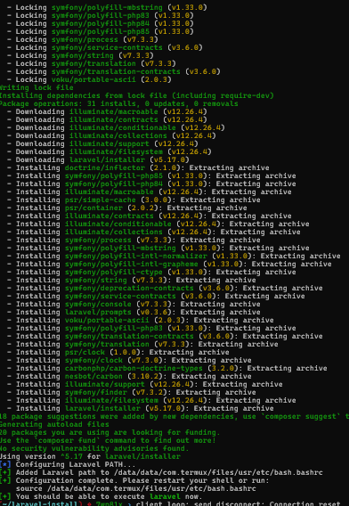

# Laravel-install
Simple laravel installer on android via termux.
## Oneline Installation:
```bash
curl -fsSL "https://raw.githubusercontent.com/7wp81x/Laravel-install/refs/heads/main/install.sh" | bash
```

## Screenshots


